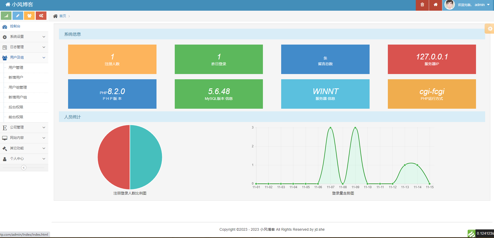

# xfadmin_tp8
ThinkPHP8 Admin后台模版
#xfadmin变更日志

## V2.0
### 2026-3-7

##### 1、增加公司管理模块,日志管理模块,api实例模块,jwt验证
##### 2、用户及组->后台权限=后台菜单,前台权限=前台菜单
##### 3、TP版本升级到8.14版本,要求PHP8.2+,(使用php8.0勉强通用但需要手动修改些地方)
##### 4、ThinkPHP框架下增加的文件
extend\fast目录下
AjaxPage.php       Ajax分页
Page.php           普通分页
Tree.php Data.php  通用的树型类，可以生成任何树型结构
Databases.php      后台线上备份数据库
Auth.php           后台Auth权限验证
IpLocation.php     IP地址显示库UTFWry.dat
Hashids.php        ID加密类
##### 5、增加了引导安装,admin后台安装:localhost/install  安装完后可能需要手动修改config/app.php数据库信息,默认是root/root
##### 6、后台登录地址localhost/admin  账号密码:admin/admin
##### 7、有的环境.htaccess URL重写方法以及遇到No input file specified的解决方法
在Fastcgi模式下，php不支持rewrite的目标网址的PATH_INFO的解析，当我们的 ThinkPHP运行在URL_MODEL=2时，就会出现
 No input file specified.的情况，
##### 这时可以修改网站目录的.htaccess文件： 
<IfModule mod_rewrite.c>
  Options +FollowSymlinks -Multiviews
  RewriteEngine On

  RewriteCond %{REQUEST_FILENAME} !-d
  RewriteCond %{REQUEST_FILENAME} !-f
  RewriteRule ^(.*)$ index.php?/$1 [QSA,PT,L]
</IfModule> 

##### 在Nginx低版本中，是不支持PATHINFO的，但是可以通过在Nginx.conf中配置转发规则实现：

 location / {        
        if (!-f $request_filename) {
        rewrite  ^(.*)$  /index.php?s=/$1  last;
        }
    }
 在新版本中支持PATHINFO
 location / {  
        try_files $uri $uri/ /index.php?s=$uri&$query_string;
    }
##### 在IIS的高版本下面可以配置web.Config，在中间添加rewrite节点：
<rewrite>
 <rules>
 <rule name="OrgPage" stopProcessing="true">
 <match url="^(.*)$" />
 <conditions logicalGrouping="MatchAll">
 <add input="{HTTP_HOST}" pattern="^(.*)$" />
 <add input="{REQUEST_FILENAME}" matchType="IsFile" negate="true" />
 <add input="{REQUEST_FILENAME}" matchType="IsDirectory" negate="true" />
 </conditions>
 <action type="Rewrite" url="index.php/{R:1}" />
 </rule>
 </rules>
 </rewrite>
 
