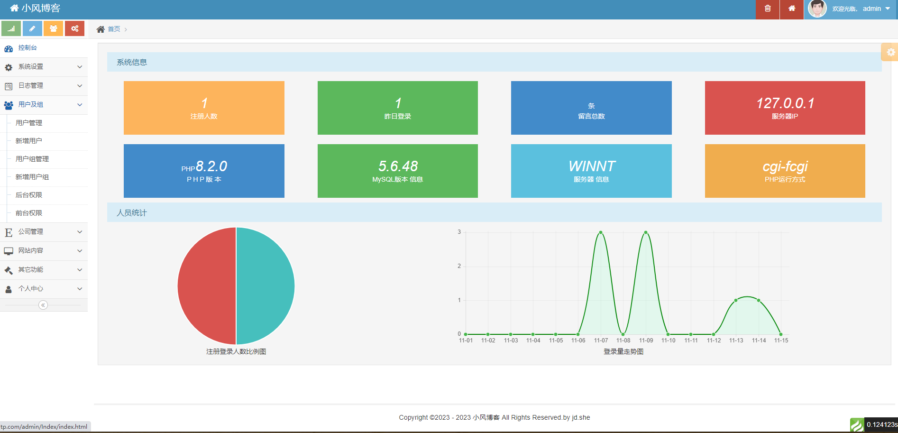

# xfadmin_tp8
ThinkPHP8 Admin后台模版
#xfadmin变更日志

## V1.0
### 2023-11-11

##### 1、增加公司管理模块,日志管理模块
##### 2、用户及组->后台权限=后台菜单,前台权限=前台菜单
##### 3、ThinkPHP框架下增加的文件,TP8版本,要求PHP8+
extend\fast目录下
AjaxPage.php       Ajax分页
Page.php           普通分页
Tree.php Data.php  通用的树型类，可以生成任何树型结构
Databases.php      后台线上备份数据库
Auth.php           后台Auth权限验证
IpLocation.php     IP地址显示库UTFWry.dat
Hashids.php        ID加数类
##### 4、增加了引导安装,admin后台安装:localhost/install  安装完后可能需要手动修改数据账号信息,默认是root/root
##### 5、后台登录地址localhost/admin  账号密码:admin
##### 6、有的环境.htaccess URL重写方法以及遇到No input file specified的解决方法
在Fastcgi模式下，php不支持rewrite的目标网址的PATH_INFO的解析，当我们的 ThinkPHP运行在URL_MODEL=2时，就会出现
 No input file specified.的情况，
##### 这时可以修改网站目录的.htaccess文件： 
<IfModule mod_rewrite.c>
  Options +FollowSymlinks -Multiviews
  RewriteEngine On

  RewriteCond %{REQUEST_FILENAME} !-d
  RewriteCond %{REQUEST_FILENAME} !-f
  RewriteRule ^(.*)$ index.php?/$1 [QSA,PT,L]
</IfModule> 
